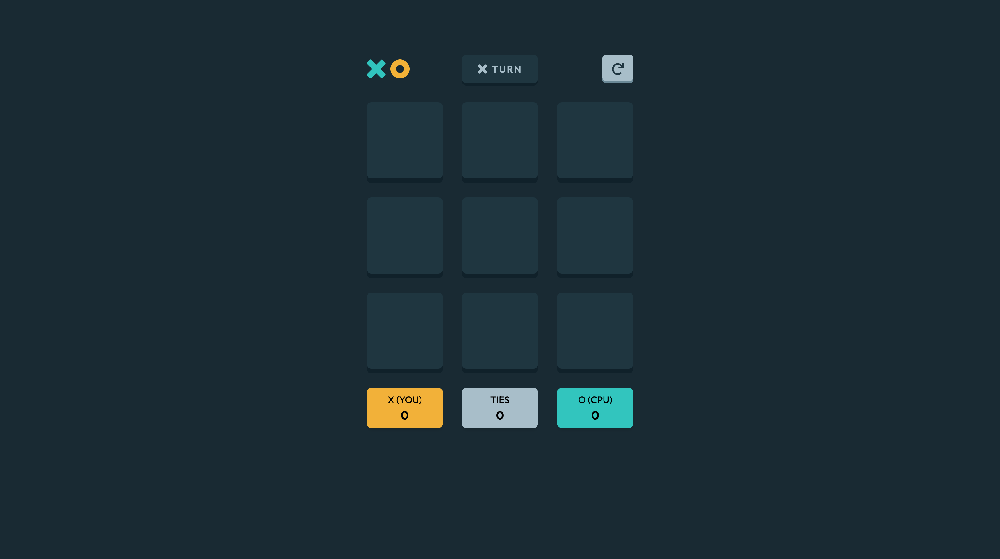

# Frontend Mentor - Rock, Paper, Scissors solution

This is a solution to the [Tic Tac Toe game challenge on Frontend Mentor](https://www.frontendmentor.io/challenges/tic-tac-toe-game-Re7ZF_E2v). Frontend Mentor challenges help you improve your coding skills by building realistic projects. 

## Table of contents

- [Overview](#overview)
  - [The challenge](#the-challenge)
  - [Screenshot](#screenshot)
  - [Links](#links)
- [My process](#my-process)
  - [Built with](#built-with)
  - [What I learned](#what-i-learned)
  - [Continued development](#continued-development) 
- [Author](#author)
- [Acknowledgments](#acknowledgments)

**Note: Delete this note and update the table of contents based on what sections you keep.**

## Overview

### The challenge

Users should be able to:

- View the optimal layout for the game depending on their device's screen size
- See hover states for all interactive elements on the page
- Play the game either solo vs the computer or multiplayer against another person
- **Bonus**: Save the game state in the browser so that it’s preserved if the player refreshes their browser
- **Bonus 2**: Instead of having the computer randomly make their moves, try making it clever so it’s proactive in blocking your moves and trying to win

### Screenshot




### Links

- Solution URL: [Solution game](https://github.com/eduardoguette/tic-tac-toe--la-vieja-)
- Live Site URL: [Play game](https://tic-tac-toe-la-vieja.vercel.app/)

## My process

### Built with

- Semantic HTML5 markup
- Talwind CSS
- Flexbox
- CSS Grid
- Mobile-first workflow
- [React](https://reactjs.org/) - JS library
- [FramerMotion](https://www.framer.com/motion/) - Framer Motion


### What I learned

This is my second game! In this opportunity I learned to develop a CPU. This is great! Although this CPU is not lot smart. 😢 but is able to play with you 😀.

Also I developed a function for detected when a player won the game
check out in the next line. 


```js
export function handleWinner(moves, player) {
  let result = []
  const movesWiners = [
    [1, 2, 3],
    [4, 5, 6],
    [7, 8, 9],
    [1, 4, 7],
    [2, 5, 8],
    [3, 6, 9],
    [1, 5, 9],
    [3, 5, 7]
  ]
  for (let i in movesWiners) {
    result = []
    moves.forEach((item) => {
      if (
        item.selected &&
        item.player === player &&
        movesWiners[i].includes(item.id)
      )
        result.push(item.id)
        
    })

    if (result.length > 2) return player
  }
}
```
 

### Continued development

I want to continue developing my CPU. I want to make it more smart. I want to make it able to play with me. 😁
 

 

**Note: Delete this note and replace the list above with resources that helped you during the challenge. These could come in handy for anyone viewing your solution or for yourself when you look back on this project in the future.**

## Author

- Frontend Mentor - [@eduardoguette](https://www.frontendmentor.io/profile/eduardoguette) 
- Twitter - [@eduardoguette](https://www.twitter.com/eduardoguette)
 
 

## Acknowledgments
 
I want to thank to [Frontend Mentor](https://www.frontendmentor.io/) for this challenge. I really enjoyed it.

